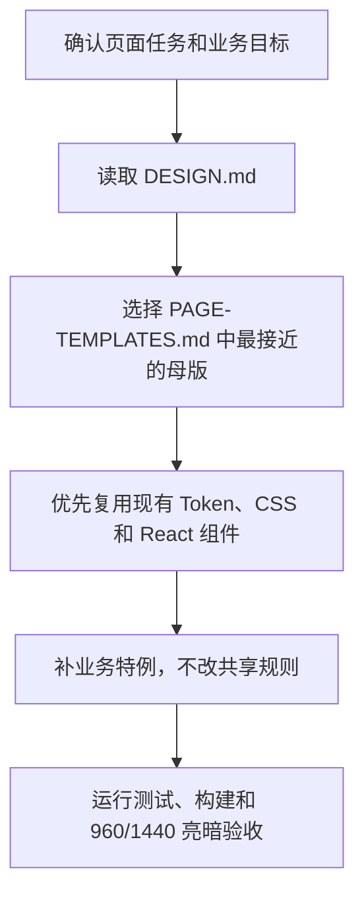

# AGENTS.md

## 使用顺序

## 必须

- `src/tokens.json` 是唯一可编辑 Token 源；修改后运行 `npm run tokens`。
- 生成的 `src/tokens.css`、`compat/youpu.css` 不手改。
- 共享组件保持无业务路由、API、账号、数据和具体业务口径。
- Modal、Drawer、AppDialog 保留 Escape、Tab 焦点圈定、焦点归还和 ARIA。
- 新的稳定规则同步 `DESIGN.md`、实现、测试、`CHANGELOG.md` 和迁移说明。

## 禁止

- 不把 Arco 变成核心依赖。
- 不制造万能组件，不复制完整业务页面。
- 不提交真实数据、密钥、数据库、Excel、ZIP 或 `.env`。
- 不使用横向 Mermaid 流程图；默认 `flowchart TD`。
