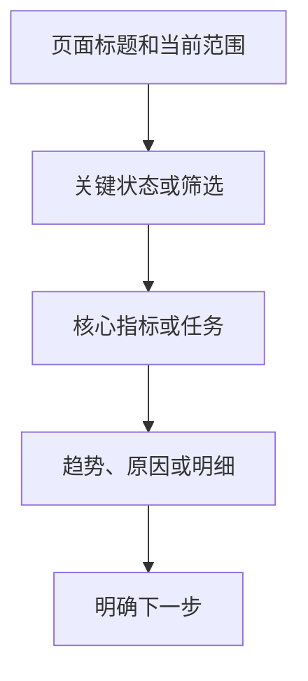

# dongV UI System · Design

## 目标

让非专业人员也能快速读懂并完成桌面运营任务：先看状态，再看原因，最后完成动作。统一基础视觉，不替业务页面决定字段和结论。

## 固定基线

| 项目 | 规则 |
|---|---|
| 页面标题 | 24px / 600 / 左对齐 |
| 正常控件 | 36px 高 |
| 页签 | 42px 高 |
| 面板圆角 | 12px |
| 浮层圆角 | 14px |
| 桌面宽度 | 960px 起，不整页缩放 |
| 内容画布 | 最大 1440px |
| 表格 | compact 44px / standard 52px / product 74px |

## 信息顺序

## 颜色与主题

- 品牌色只用于主动作、选中和重点，不大面积铺满。
- 成功、提醒、危险、信息分别使用语义 Token，不用颜色代替文字。
- 亮暗主题只通过 `data-theme="light|dark"` 和 `--dv-*` 切换。
- 项目可覆盖 `--dv-brand`，但需同时检查对比度和焦点可见性。

## 组件边界

- 自研组件负责有明确交互契约的 PageHeader、Tabs、表格、状态、Select、浮层、页面状态和两类图表。
- Arco 只允许目标项目自行选用；本包不导入、不要求安装。
- 新需求先作为单页实现；至少第二处出现且用途一致，才进入共享层。

## 无障碍

- 所有交互可用键盘完成；焦点清晰可见。
- Modal、Drawer、AppDialog 使用 dialog 语义、`aria-modal`、Escape 关闭、Tab 圈定和关闭后焦点归还。
- Tooltip 只放短说明；需要点击、复制或长内容时用 HelpPopover、Modal 或 Drawer。
- 遵循 `prefers-reduced-motion`。
