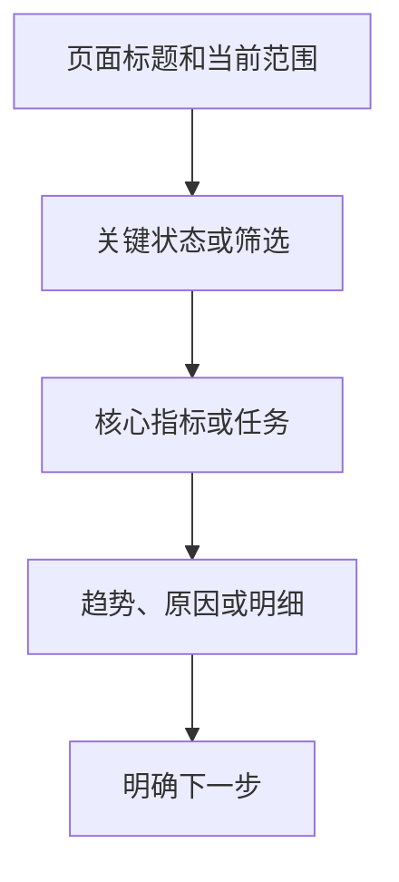

# dongV UI System · Design

## 目标

让非专业人员也能快速读懂并完成桌面运营任务：先看状态，再看原因，最后完成动作。统一基础视觉，不替业务页面决定字段和结论。

## 固定基线

| 项目 | 规则 |
|---|---|
| 页面标题 | 24px / 600 / 左对齐 |
| 正常控件 | 36px 高 |
| 页签 | 42px 高 |
| 面板圆角 | 12px |
| 浮层圆角 | 14px |
| 桌面宽度 | 960px 起，不整页缩放 |
| 内容画布 | 最大 1440px |
| 表格 | compact 44px / standard 52px / product 74px |

## 信息顺序

## 颜色与主题

- 品牌色只用于主动作、选中和重点，不大面积铺满。
- 成功、提醒、危险、信息分别使用语义 Token，不用颜色代替文字。
- 亮暗主题只通过 `data-theme="light|dark"` 和 `--dv-*` 切换。
- 项目可覆盖 `--dv-brand`，但需同时检查对比度和焦点可见性。

## 组件边界

- 普通表单优先使用原生控件；需要浮层定位、表格紧凑模式或统一键盘契约时再用公共 `Select`。
- `Select` 是新项目入口；`SingleSelect`、`youpu-*` class 和 `compat/youpu.css` 只为有谱 V1 兼容保留，不继续扩展第二套能力。
- 自研组件只负责已有明确契约的 PageHeader、Tabs、表格、状态、浮层、页面状态和两类图表。
- Arco 只允许目标项目自行选用；本包不导入、不要求安装。
- 新需求先作为单页实现；至少第二处出现且用途一致，才进入共享层。
- `components.css` 只作用于本包组件范围，不提供全站 reset，不应修改宿主项目的普通按钮、表单、焦点或动效。

## 无障碍

- 所有交互可用键盘完成；焦点清晰可见。
- `Select` 按非可编辑 combobox + listbox 契约暴露状态、当前选项和键盘导航。
- Modal、Drawer、AppDialog 使用 dialog 语义、`aria-modal`、Escape 关闭、Tab 圈定和关闭后焦点归还；标题和描述 ID 必须唯一，空描述不建立无效引用。
- Tooltip 只放非交互短说明。`HelpPopover` 只是样式容器，不默认冒充 tooltip；调用方必须自行提供 `role`、`id` 和触发器关系，含点击、复制或表单时改用 Modal 或 Drawer。
- 遵循 `prefers-reduced-motion`，且只影响本包组件范围。
