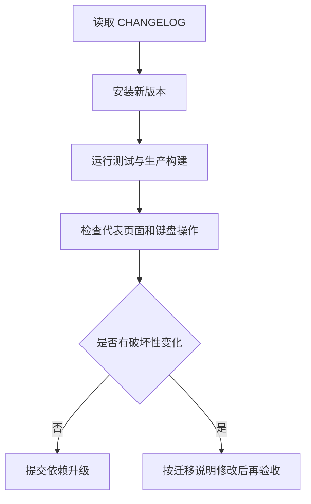

# 迁移与升级

## 从优谱 `ui-kit/` 迁移

1. 安装 Release tgz。
2. 引入 `tokens.css` 和 `components.css`。
3. 旧页面仍使用 `--yp-*` 时，再引入 `compat/youpu.css`。
4. 原本从本地共享组件导入的文件改成薄转发：`export * from "dongv-ui-system/react"`。
5. 删除薄转发文件中的组件实现和样式副本，只保留兼容入口。
6. 运行项目测试、生产构建和 960/1440 亮暗主题验收。

## V1 兼容决定

React 组件内部继续输出 `youpu-*` 等已存在 class，避免优谱业务样式一次性大改。它们在 V1 内视为兼容契约；新的公共 Token 只使用 `--dv-*`。

## 升级规则

