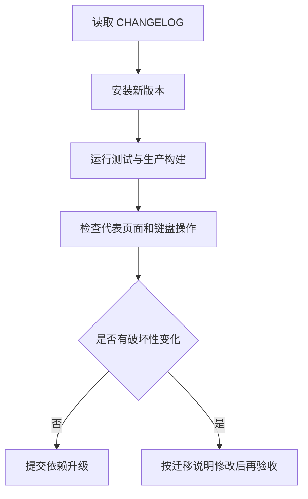

# 迁移与升级

## 从优谱 `ui-kit/` 迁移

1. 安装 Release tgz。
2. 引入 `tokens.css` 和 `components.css`。
3. 旧页面仍使用 `--yp-*` 时，再引入 `compat/youpu.css`。
4. 原本从本地共享组件导入的文件改成薄转发：`export * from "dongv-ui-system/react"`。
5. 删除薄转发文件中的组件实现和样式副本，只保留兼容入口。
6. 运行项目测试、生产构建和 960/1440 亮暗主题验收。

## V1 兼容决定

React 组件内部继续输出 `youpu-*` 等已存在 class，避免优谱业务样式一次性大改。它们在 V1 内视为兼容契约；新的公共 Token 只使用 `--dv-*`。

## 升级规则

## 1.0.2 焦点样式

- 公共组件焦点由品牌红光圈改为中性焦点线。
- `PageTabs`、`Select` 和 `SingleSelect` 不再把焦点或悬停显示成粉红底色；真实选中态仍通过文字、下划线或中性底色辨认。
- 宿主项目若有局部 `:focus` / `:focus-visible` 品牌色规则，应同步改为中性边框或中性焦点线。

## 下一版本安全间距

- `DataTable` 的 `th/td` 默认使用横向 `10px`、纵向 `6px` 内边距；紧凑业务页可通过 `--youpu-data-table-cell-padding-inline` 和 `--youpu-data-table-cell-padding-block` 覆盖，但不得压到零。
- `LoadingState`、`EmptyState`、`ErrorState` 默认有 `16px` 内边距；大表空状态仍应由业务页增加最小高度和至少 `24px` 留白。
- 若旧页面已给单元格设置 padding，升级后检查是否重复；保留一处明确规则即可。
