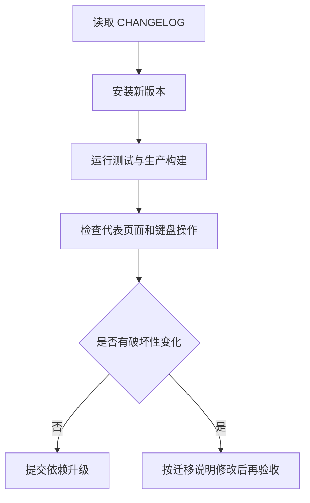

# 迁移与升级

## 从优谱 `ui-kit/` 迁移

1. 安装 Release tgz。
2. 引入 `tokens.css` 和 `components.css`。
3. 旧页面仍使用 `--yp-*` 时，再引入 `compat/youpu.css`。
4. 原本从本地共享组件导入的文件改成薄转发：`export * from "dongv-ui-system/react"`。
5. 删除薄转发文件中的组件实现和样式副本，只保留兼容入口。
6. 运行项目测试、生产构建和 960/1440 亮暗主题验收。

## V1 兼容决定

React 组件内部继续输出 `youpu-*` 等已存在 class，避免优谱业务样式一次性大改。它们在 V1 内视为兼容契约；新的公共 Token 只使用 `--dv-*`。

## 升级规则

## 1.0.2 焦点样式

- 公共组件焦点由品牌红光圈改为中性焦点线。
- `PageTabs`、`Select` 和 `SingleSelect` 不再把焦点或悬停显示成粉红底色；真实选中态仍通过文字、下划线或中性底色辨认。
- 宿主项目若有局部 `:focus` / `:focus-visible` 品牌色规则，应同步改为中性边框或中性焦点线。

## 1.0.4 状态与安全间距

- `DataTable` 的 `th/td` 默认居中、使用横向 `10px`、纵向 `6px` 内边距并垂直居中；表格数字继承等宽数字。商品名、说明等文本列由业务单元格显式覆盖对齐，多行内容可设置 `data-vertical-align="top"`。紧凑业务页可覆盖两个 padding 变量，但不得压到零。
- 多行输入优先使用 `Textarea`；它保留原生 `rows`，默认 3 行，支持五档 `size`、`invalid` 和四种 `resize` 模式。不要为了套组件重写现有页面的业务字段或提交行为。
- 二值勾选优先使用 `Checkbox`；`children` 会生成可点击标签，`indeterminate` 同时提供混合态无障碍语义和原生属性。保留业务侧 `onChange` 与受控 `checked` 数据流。
- `LoadingState`、`EmptyState`、`ErrorState` 新增 `scope="inline|table|section|page"`。默认 `section`；表格空状态使用 `table`，整页加载或错误使用 `page`，紧邻控件的短状态使用 `inline`。
- 公共状态组件现在默认负责 padding、居中和最小高度。旧页面若已有完整状态布局，应删除重复规则或确认其没有把公共 padding 压成零。

## 1.2.0 控件与加载契约

- `Button`、`Input`、`Select` 的 `size` 统一为 `table|small|compact|medium|large`；旧 `compactTable` 继续可用并映射到 `table`。
- 多行输入优先使用 `Textarea`，二值勾选优先使用 `Checkbox`；两者都保留原生语义，不需要业务侧重写键盘和 ARIA。
- `LoadingState scope="table"` 可用 `rows`、`columns` 和 `density` 输出稳定骨架；短请求延迟由请求编排负责，不要在组件内新增隐式定时器。
- 升级后运行接入项目的测试、生产构建和代表页面视觉验收；不要直接批量替换已验收的业务页面。

## 控件尺寸

- `Button`、`Input`、`Select` 统一支持 `table=28px`、`small=30px`、`compact=32px`、`medium=36px`、`large=42px`；省略 `size` 或传入未知值均回退到 `medium`。
- `Select` 的旧 `compactTable` 入口继续保留原 class 和视觉行为；新代码可改用 `size="table"`。
`LoadingState` 表格骨架的 `rows`、`columns` 只接受 1—20 的整数（非整数或无法解析时使用默认值 4/6，超出范围会截断到边界）；未提供列布局时按等宽占位，不能直接用于带业务 `colgroup` 的真实表格。
