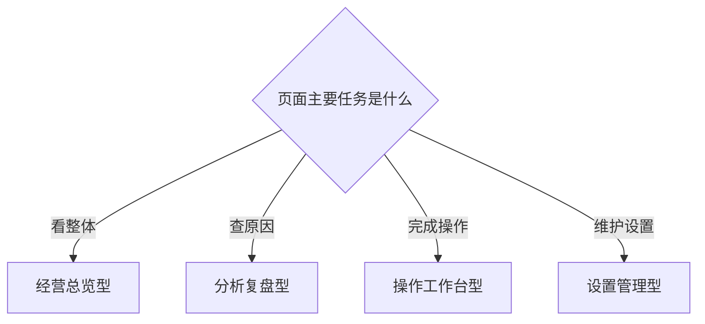

# 页面母版

母版只固定信息顺序，不固定业务字段。

| 母版 | 适用场景 | 默认顺序 |
|---|---|---|
| 经营总览型 | 先看整体状态和重点 | 状态 → 指标 → 关注点 → 主表 |
| 分析复盘型 | 看周期、趋势和结论 | 范围/周期 → 趋势 → 结论 → 明细 |
| 操作工作台型 | 筛选对象并完成动作 | 筛选 → 待处理表 → Drawer/Modal → 结果反馈 |
| 设置管理型 | 查看配置并低频修改 | 配置状态 → 设置列表 → 编辑入口 → 修改记录 |

不要为了统一把所有页面做成一个版型；没有合适母版时先证明新结构会重复出现，再新增。
